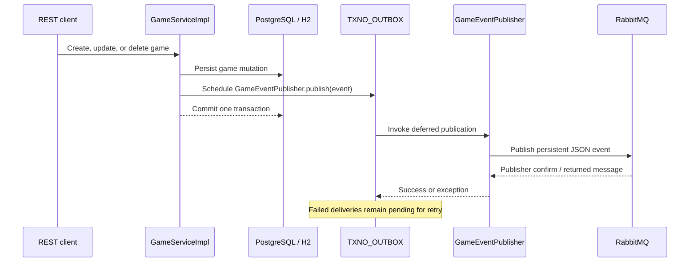

# Message Broker Configuration and Migration Guide

## Purpose

This document describes the current durable event-delivery implementation, which uses RabbitMQ through the AMQP protocol, and provides a controlled migration path to Kafka or Azure Service Bus.

The business event model and the transactional outbox are intentionally broker-agnostic. Only the outbound messaging adapter and its infrastructure configuration are tied to RabbitMQ.

## Current Architecture

Game commands create a domain event in the same database transaction that changes the game. The [Gruelbox Transaction Outbox](https://github.com/gruelbox/transaction-outbox) library persists a deferred invocation in its `TXNO_OUTBOX` table. Once the transaction commits, it invokes the active `GameEventPublisher` implementation.



This arrangement prevents an event from being published for a rolled-back game mutation. It does **not** provide exactly-once delivery to consumers: delivery is at least once, so downstream consumers must deduplicate using `eventId`.

### Event contract

The application emits these versioned events:

| Event type | AMQP routing key | Trigger |
|---|---|---|
| `GameCreatedEvent` | `games.created` | A game is created |
| `GameUpdatedEvent` | `games.updated` | A game is updated |
| `GameDeletedEvent` | `games.deleted` | A game is deleted |

Every event contains:

- `eventId`: UUID used as the message ID and idempotency key.
- `gameId`: identifier of the affected game.
- `occurredAt`: UTC instant at which the application created the event.
- `snapshot`: full game state at the time of the command, including the final state before deletion.
- `eventVersion`: currently `1`.
- `eventType`: the simple Java event class name.

The RabbitMQ adapter serializes the event as JSON and adds the following AMQP properties:

| Property | Value |
|---|---|
| Delivery mode | Persistent |
| Message ID | `eventId` |
| Type | `eventType` |
| Header `eventVersion` | `eventVersion` |
| Correlation ID | `eventId` through RabbitMQ `CorrelationData` |

## RabbitMQ / AMQP Configuration

### Dependencies and activation

The current implementation includes Spring AMQP through `spring-boot-starter-amqp` and the Gruelbox Spring integration through `transactionoutbox-spring`.

`RabbitMqConfiguration` and `RabbitMqGameEventPublisher` are active when neither the `test` nor the `security` profile is selected. In these profiles, `TestGameEventPublisher` replaces the real publisher and only logs the event; it does not contact RabbitMQ.

### Connection and recovery settings

The default configuration reads the broker connection URI from the `RABBITMQ_URL` environment variable:

```properties
spring.rabbitmq.addresses=${RABBITMQ_URL}
app.events.recovery-delay=PT60S
```

Use an `amqp://` or `amqps://` URI appropriate for the selected RabbitMQ instance. Keep this URI in the runtime secret store; it can include credentials and must not be committed to source control.

The outbox configuration retries due invocations every 60 seconds and blocks an entry after three failed attempts. A scheduled recovery component calls `TransactionOutbox.flush()` with the same configurable `app.events.recovery-delay` interval. Normal delivery is attempted after the transaction commits; recovery handles pending failed work.

### Broker topology

At application startup, Spring AMQP declares this durable topology:

| Resource | Name | Configuration |
|---|---|---|
| Topic exchange | `game.events` | Durable, non-auto-delete |
| Primary queue | `game.events.queue` | Durable; dead-letter exchange set to `game.events.dlx` |
| Primary binding | `game.events.queue` ← `game.events` | Topic pattern `games.#` |
| Dead-letter exchange | `game.events.dlx` | Durable direct exchange, non-auto-delete |
| Dead-letter queue | `game.events.dlq` | Durable |
| Dead-letter binding | `game.events.dlq` ← `game.events.dlx` | Direct binding key `#` |

The publisher sends each event to the `game.events` exchange with one of the routing keys listed in the event contract table. `RabbitTemplate` is configured with mandatory publishing, correlated publisher confirms, and publisher returns. The adapter waits up to five seconds for a positive confirm and fails the outbox invocation for a negative confirm, timeout, execution failure, or returned (unroutable) message.

### Important dead-letter limitation

The current dead-letter exchange is a `DirectExchange`, and its queue binding key is the literal `#`. Direct exchanges do not interpret `#` as a wildcard. Without an `x-dead-letter-routing-key` on the primary queue, RabbitMQ forwards the original routing key (for example, `games.created`) when dead-lettering. Consequently, the current binding does **not** route those messages to `game.events.dlq`.

Before depending on the dead-letter queue operationally, correct the topology by either:

1. Changing the dead-letter exchange to a topic exchange and retaining the `#` binding, or
2. Configuring a matching direct binding for each emitted routing key, or
3. Setting a fixed `x-dead-letter-routing-key` that matches the direct binding.

No consumer is implemented in this service, so message acknowledgement, rejection, retry, and dead-lettering behavior must also be defined by each downstream consumer.

## Stable Broker Boundary

The migration boundary is the application port:

- `GameEventOutboxWriter` schedules an event for durable delivery.
- `GameEventPublisher` exposes `publish(GameEvent event)`.
- `TransactionOutboxGameEventWriter` stores the deferred invocation.

Keep these ports, event classes, and service-layer command flow unchanged. A new technology should be introduced as a new adapter implementing `GameEventPublisher` under `adapter.out.messaging`. Configuration and provider SDK clients belong under `infrastructure.config`.

This preserves the hexagonal architecture: neither `GameServiceImpl` nor the domain model should import AMQP, Kafka, or Azure SDK classes.

## Common Migration Procedure

Use this procedure for any replacement broker.

1. **Define the target contract.** Keep the JSON event fields, `eventId`, `eventVersion`, and semantics stable. Version event schemas additively and create a new version when a breaking change is unavoidable.
2. **Provision the destination topology.** Create the topic, queue, subscription, retention policy, access identities, and dead-letter handling with infrastructure as code rather than relying only on application startup declarations.
3. **Add the provider dependency and configuration.** Remove `spring-boot-starter-amqp` only after no active code or health check requires it. Bind connection data from environment variables or a managed identity; never hard-code credentials.
4. **Implement a target-specific `GameEventPublisher`.** Serialize the existing `GameEvent`, include `eventId` as the provider message ID, preserve `eventType` and `eventVersion` as headers or application properties, and wait for the provider acknowledgement before returning successfully.
5. **Activate exactly one production publisher.** Use explicit profiles or conditional configuration. The application context must have one `GameEventPublisher` bean for production and the existing no-op publisher for tests.
6. **Keep the transactional outbox.** If publication fails, throw an exception from `publish`. This allows the existing outbox retry and blocking policy to continue protecting database-to-broker delivery.
7. **Migrate consumers safely.** Make consumers idempotent by storing or otherwise recognizing `eventId`. Run consumers against both old and new destinations during the cutover, but avoid processing the same event twice.
8. **Validate failure paths.** Test broker unavailability, publish rejection, acknowledgement timeout, malformed payloads, consumer retry, dead-letter handling, and duplicate delivery.
9. **Observe and cut over.** Monitor outbox backlog, blocked outbox entries, publish latency/failures, consumer lag, and dead-letter volume. Drain the old destination before decommissioning it.

## Migration to Kafka

### Target mapping

| Current AMQP concept | Kafka equivalent |
|---|---|
| `game.events` topic exchange | Kafka topic, for example `game.events.v1` |
| Routing key | Event type header; optionally topic name for separate event streams |
| `game.events.queue` | Consumer group offset for each independent consumer |
| Durable AMQP message | Kafka record with broker replication and retention |
| RabbitMQ DLQ | Retry topic(s) and a dead-letter topic, for example `game.events.dlt` |
| Publisher confirm | `KafkaTemplate` send result with `acks=all` and idempotence enabled |

Use `gameId` as the Kafka record key when ordering for one game matters. Kafka only preserves ordering within a partition, so records for a given key must use the same topic and key.

### Implementation steps

1. Add Spring for Apache Kafka and configure bootstrap servers through an environment variable such as `KAFKA_BOOTSTRAP_SERVERS`.
2. Create `KafkaGameEventPublisher` implementing `GameEventPublisher`.
3. Send JSON to `game.events.v1` with `gameId` as the record key, `eventId` as a header, and `eventType` and `eventVersion` as headers.
4. Configure producer acknowledgement and durability: `acks=all`, idempotence enabled, suitable retry limits, and delivery timeout aligned with the outbox behavior.
5. Wait for the send future before returning. Convert send failures or timeouts into exceptions so the outbox retries them.
6. Provision retry and dead-letter topics, topic partitions, replication factor, retention, ACLs, and consumer groups through the deployment platform.
7. Make consumer offset commits occur only after successful, idempotent business processing. Send exhausted failures to the dead-letter topic with the original event metadata.
8. Add focused adapter tests with an embedded or containerized Kafka broker and retain the no-op test-profile publisher for unit and web tests.

Do not model a Kafka consumer group as a direct replacement for one RabbitMQ queue without considering replay, retention, partitioning, and independent consumer groups. Kafka consumers can replay retained history, which changes operational and privacy requirements.

## Migration to Azure Service Bus

### Target mapping

| Current AMQP concept | Azure Service Bus equivalent |
|---|---|
| `game.events` topic exchange | Service Bus topic, for example `game-events` |
| Primary queue and topic binding | A subscription to the topic, for example `game-events/game-events-consumer` |
| Routing key | Subject and application properties such as `eventType` and `eventVersion` |
| RabbitMQ DLQ | The built-in dead-letter subqueue for a queue or subscription |
| RabbitMQ publisher confirm | Successful `ServiceBusSenderClient.sendMessage` completion |

A Service Bus **topic** with subscriptions is the closest match for fan-out events. Use a queue only when there is one competing-consumer workflow rather than independent event consumers.

### Implementation steps

1. Add the Azure Service Bus Spring integration or Azure Messaging Service Bus SDK and manage its version through the Azure SDK BOM.
2. Provision a namespace, topic, subscriptions, authorization or managed identity, retry policy, and dead-letter monitoring. Enable duplicate detection only if its time window and throughput trade-offs match the event workload; still retain consumer idempotency.
3. Bind the fully qualified namespace and authentication through managed identity where possible. If a connection string is required, expose it only as a secret environment variable such as `AZURE_SERVICEBUS_CONNECTION_STRING`.
4. Create `AzureServiceBusGameEventPublisher` implementing `GameEventPublisher`.
5. Create a `ServiceBusMessage` containing the JSON event. Set `messageId` to `eventId`, `subject` to `eventType`, and application properties for `eventVersion`, `gameId`, and `occurredAt`.
6. Wait for the send operation to complete before returning. Surface client exceptions so the transaction outbox retries the event.
7. Configure each subscription's max delivery count, lock duration, retry strategy, and dead-letter alerting. Consumers should use peek-lock settlement only after successful idempotent processing.
8. Use subscription filters on `subject` or application properties when a consumer only needs some event types.
9. Test with an Azure test namespace or emulator-compatible strategy, test identity/authorization failures, and verify access to the subscription dead-letter subqueue.

Azure Service Bus supports the AMQP protocol, but this does not make the current RabbitMQ topology portable. RabbitMQ exchanges, routing keys, queue arguments, publisher confirms, and Azure Service Bus topics/subscriptions have different semantics. Migrate through the application port rather than attempting to reuse the RabbitMQ adapter.

## Cutover Checklist

- [ ] The event JSON contract and versioning policy are documented and approved.
- [ ] The target broker topology, identities, and secrets are provisioned outside the application.
- [ ] Exactly one production `GameEventPublisher` is active.
- [ ] The target adapter returns an exception for an unacknowledged or failed publish.
- [ ] The transactional outbox remains enabled and its recovery interval is configured.
- [ ] Consumers are idempotent on `eventId`.
- [ ] Retry and dead-letter behavior is tested end to end.
- [ ] Dashboards and alerts cover outbox backlog, producer failures, consumer lag, and dead-letter messages.
- [ ] RabbitMQ traffic has been drained and verified before removing the AMQP dependency and configuration.

## Relevant Source Files

- `pom.xml`: AMQP and Transaction Outbox dependencies.
- `src/main/resources/application.properties`: RabbitMQ URI and recovery interval.
- `src/main/java/es/marugi/spring/api/infrastructure/config/RabbitMqConfiguration.java`: RabbitMQ topology, JSON conversion, confirms, and returns.
- `src/main/java/es/marugi/spring/api/infrastructure/config/EventDispatchConfiguration.java`: Transactional Outbox setup and retry policy.
- `src/main/java/es/marugi/spring/api/infrastructure/config/TransactionOutboxRecovery.java`: Scheduled outbox recovery.
- `src/main/java/es/marugi/spring/api/adapter/out/persistence/TransactionOutboxGameEventWriter.java`: Durable event scheduling.
- `src/main/java/es/marugi/spring/api/adapter/out/messaging/RabbitMqGameEventPublisher.java`: Current AMQP publishing adapter.
- `src/main/java/es/marugi/spring/api/adapter/out/messaging/TestGameEventPublisher.java`: No-op publisher for `test` and `security` profiles.
